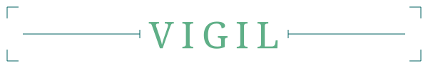
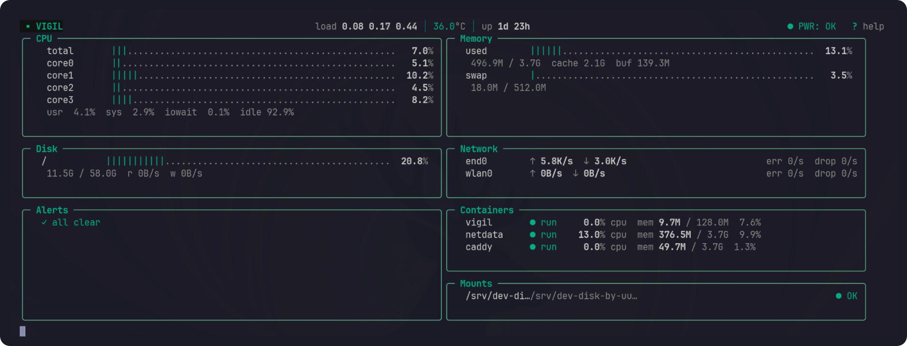

<p align="center">
  
</p>

<p align="center">
  <em>A single binary that watches your Pi around the clock. No stack, no agents, no noise.</em>
</p>

<p align="center">
  
</p>

<p align="center">
  
  <a href="https://github.com/baudsmithstudios/vigil/releases/latest"></a>
  <a href="LICENSE"></a>
  
  
  
</p>

## Features

- **TUI dashboard** — live gauges, per-core CPU bars, responsive grid layout, alert panel
- **Docker container monitoring** — opt-in per-container CPU %, memory, and status via Docker Engine API
- **Mount watchdog** — opt-in mount presence monitoring with debounced alerts, flap detection, and interactive config helper
- **Persistent storage** — SQLite (WAL mode), configurable retention, batched writes
- **Alerting** — threshold and rate-of-change rules with Discord/webhook/ntfy.sh notifications and quiet hours
- **Service health checks** — HTTP endpoint and TCP port monitoring with consecutive-failure alerting
- **Pi power health** — under-voltage and throttle detection from sysfs, with `vcgencmd` fallback
- **Headless mode** — `--headless` for background collection without a terminal
- **Single-shot JSON output** — `--once --json` for scripts, cron snapshots, and integrations
- **Hardened by default** — read-only root filesystem, no capabilities, non-root user, resource limits

## Quick Start

> For cross-compilation, external drive setup, and Pi-specific steps, see [DEPLOYMENT](docs/DEPLOYMENT.md).

```sh
git clone https://github.com/baudsmithstudios/vigil.git && cd vigil

# Build the image (or cross-compile for ARM64 — see DEPLOYMENT.md)
docker build -t vigil:latest --load .

# Generate a config interactively
./vigil.sh init

# Set your external drive path in docker-compose.yml
#   - /your/mount/point/vigil:/data
docker compose up -d

# Open the live dashboard (detach: Ctrl+P then Ctrl+Q)
docker attach vigil
```

## Interactive Setup

`vigil.sh init` walks through configuration interactively — detecting your environment, prompting for thresholds, and writing a validated `config.toml`. The wrapper script runs the Vigil binary inside Docker with the right volume mounts.

```sh
./vigil.sh init                          # create config.toml in current directory
./vigil.sh init -config custom.toml      # custom filename
```

The flow covers database path, mount detection, alert thresholds, and optional features (Docker monitoring, notifications, service checks, interval tuning). A preview is shown before writing.

## Metrics

For scripting and external integrations, run one collection tick and write JSON to stdout:

```sh
vigil --once --json
```

For Docker deployments, run the same one-shot command through Compose:

```sh
docker compose run --rm vigil --once --json
```

This mode does not start the TUI, write SQLite data, evaluate alerts, send notifications, or run background collection loops. The output is a single JSON object with stable snake_case fields such as `cpu.percent_total`, `memory.percent`, `disks[].percent`, `load.load1`, `temperature[].celsius`, `throttle.status`, `services[].up`, and `uptime_sec`.
First-tick rate fields, including CPU percentage and I/O throughput, follow normal collector semantics and may report warm-up values.

| Section | What's collected |
|---|---|
| **CPU** | Total %, per-core %, user/system/iowait/idle breakdown |
| **Load** | 1, 5, 15-minute averages |
| **Memory** | Used %, used/total, cached, buffers, swap, swap in/out rate |
| **Disk** | Used % per mount, read/write throughput per device, utilization %, avg I/O latency |
| **Network** | Send/recv rates per interface, error and drop rates |
| **Temperature** | All thermal sensors; Pi fallback via `/sys/class/thermal` |
| **Throttle** | Pi under-voltage, frequency cap, throttling, and soft temperature limit flags |
| **SD card** | MMC error counter deltas (best-effort from debugfs) |
| **Containers** | Name, status, CPU %, memory used/limit per container (opt-in) |
| **Mounts** | Presence check per configured mount point, flap detection (opt-in) |
| **Services** | HTTP response status/latency and TCP port reachability (opt-in) |

Virtual filesystems (tmpfs, overlay, squashfs) and Docker network interfaces (veth, br-, docker*) are filtered out.
SD/MMC error counters come from `/sys/kernel/debug/mmc*/err_stats` when available. On hardened/non-root deployments this may be unavailable; Vigil logs a warning once and continues.

### Alert Metric Keys

| Key | Description |
|---|---|
| `cpu_percent` | Total CPU % |
| `cpu_iowait` | CPU iowait % |
| `mem_percent` | RAM used % |
| `swap_percent` | Swap used % |
| `swap_in` / `swap_out` | Swap I/O rate in bytes/sec |
| `disk_percent` | Disk used % (all partitions, prefix match) |
| `disk_util` | Disk utilization % (all devices, prefix match) |
| `disk_latency_ms` | Average disk I/O latency in ms (all devices, prefix match) |
| `sd_errors` | SD/MMC error counter delta (all hosts, prefix match) |
| `load1` / `load5` / `load15` | Load averages |
| `temp` | Temperature in degrees C (all sensors, prefix match) |
| `net_drops` | Network packet drops/sec (all interfaces, prefix match) |
| `net_errors` | Network errors/sec (all interfaces, prefix match) |
| `throttle` | Pi under-voltage, frequency cap, throttling, or soft temperature limit active now |
| `mount_missing:<path>` | Mount disappeared (after 3-tick debounce) |
| `mount_unstable:<path>` | Mount flapping (3+ cycles in 5 minutes) |
| `service_down:<name>` | Service unreachable (after N consecutive failures) |

## Configuration

All fields are optional — Vigil runs zero-config with sane defaults. Generate a config with `./vigil.sh init` or edit `config.toml` directly:

| Field | Default | Description |
|---|---|---|
| `db_path` | `/data/vigil.db` | SQLite database path |
| `interval` | `2s` | Collection interval |
| `retention` | `12h` | Reading retention before purge |
| `theme` | `auto` | Color theme: `auto`, `dark`, or `light` |
| `[[alerts]]` | CPU/mem/disk at 90% (zero-config) | Threshold alert rules |
| `[notifications]` | _(disabled)_ | Discord/webhook/ntfy.sh delivery |
| `[docker]` | _(disabled)_ | Container monitoring |
| `[[mount_checks]]` | _(disabled)_ | Mount presence monitoring |
| `[services]` | `interval = "30s"`, `failures_before_alert = 2` | Service check behavior |
| `[[http_checks]]` | _(disabled)_ | HTTP endpoint health checks |
| `[[port_checks]]` | _(disabled)_ | TCP port reachability checks |

### Alerts

```toml
[[alerts]]
metric          = "cpu_percent"
threshold       = 90.0
above           = true
message         = "CPU above 90%"
delta_threshold = 40.0            # optional: fire on sudden spike
sustained_ticks = 3               # optional: require 3 consecutive ticks before firing
```

Rules support `threshold`, `delta_threshold`, or both. Threshold alerts fire when a value crosses a sustained level. Delta alerts fire on sudden spikes and auto-resolve when the rate of change drops. `sustained_ticks` delays firing until the condition persists for N consecutive collection ticks — useful for noisy metrics like network drops where a single blip isn't actionable.
`vigil init` writes a Pi-focused starter set that also includes swap activity, CPU iowait, disk utilization/latency, and SD/MMC error alerts.

A specific rule like `disk_latency_ms:mmcblk0` shadows the generic `disk_latency_ms` rule for that one device, so per-device overrides don't double-fire alongside the catch-all.

#### SD card latency noise

SD/MMC cards have spiky tail latency by design — bursts to 100-500ms are normal during journald flushes, log rotation, and the card's own garbage collection — so the generic 50ms `disk_latency_ms` threshold is noisy on the Pi's root SD while still being the right bar for an external `/data` drive. `vigil init` detects SD/MMC devices and writes a relaxed override (`disk_latency_ms:mmcblk0` at 200ms, sustained 5 ticks) on top of the generic 50ms rule. If you have a hand-edited config from v0.2.0 or v0.3.0 and you're seeing transient `disk_latency_ms:mmcblk*` alerts that resolve immediately, add the override by hand or re-run `vigil init` against a fresh config path and copy the new alerts across.

### Notifications

```toml
[notifications]
discord_webhook = "https://discord.com/api/webhooks/..."
webhook_url     = "https://example.com/alerts"
ntfy_topic      = "vigil-alerts"
ntfy_server     = "https://ntfy.sh"  # optional, defaults to https://ntfy.sh
quiet_hours     = ["02:00-06:00"]
```

Channels can be enabled simultaneously. Quiet hours suppress delivery only — alerts still fire and persist. Press `m` in the TUI for session-level mute.
ntfy topics are treated as secrets and must contain only letters, numbers, hyphens, and underscores. Custom ntfy servers must be HTTPS origins without paths, queries, fragments, or credentials.

### Docker Container Monitoring

```toml
[docker]
socket = "/var/run/docker.sock"
```

Disabled by default. Requires the Docker socket to be mounted — see [Enabling container monitoring](#enabling-container-monitoring) and [Security](#security) before enabling.

When enabled, a "Containers" panel appears in the TUI with color-coded status. Container metrics are persisted to the `container_metrics` SQLite table on the same retention schedule.

### Mount Watchdog

```toml
[[mount_checks]]
path = "/mnt/data"
label = "NAS Storage"

[[mount_checks]]
path = "/media/usb0"
label = "USB Backup Drive"
```

Watches configured mount points for disappearance — the #1 silent failure on Raspberry Pi. When a mount goes missing for 3 consecutive ticks (~6 seconds), a `mount_missing` alert fires with a notification. If a mount flaps (disappears and reappears 3+ times within 5 minutes), a separate `mount_unstable` alert fires. Both auto-resolve when the condition clears.

A "Mounts" panel appears in the TUI showing each path with `● OK`, `✖ MISSING`, or `⚠ UNSTABLE` status.

Use `vigil.sh mounts` to discover and configure mount points after initial setup. During `vigil.sh init`, mount selection runs automatically if physical mounts are detected.

```sh
./vigil.sh mounts                        # discover and configure
./vigil.sh mounts -config custom.toml    # custom config path
```

### Service Health Checks

```toml
[services]
interval = "30s"
failures_before_alert = 2

[[http_checks]]
name = "homeassistant"
url = "http://192.0.2.50:8123"
expected_status = 200              # optional, defaults to any 2xx

[[port_checks]]
name = "mqtt"
host = "192.0.2.50"
port = 1883
```

Monitors HTTP endpoints and TCP ports on a background interval. A `service_down:<name>` alert fires after N consecutive failures (default 2) and auto-resolves when the service responds again. A "Services" panel appears in the TUI showing status, latency, and last-checked time. Results are persisted to the `service_checks` SQLite table.

## Docker Deployment

The compose file mounts `/proc` and `/sys` read-only so gopsutil reports host metrics. `/dev/vcio` is mounted to allow `vcgencmd` throttle reads on Raspberry Pi. Config is bind-mounted at runtime to keep secrets out of image layers.

> **Non-Pi hosts:** Comment out the `/dev/vcio` device mount and the video group GID (`44`) in `docker-compose.yml` — throttle detection is Pi-only and the device won't exist on other hardware.

**Before starting:**
1. Generate a config: `./vigil.sh init` (no config.toml is included — this is the intended first step)
2. Set your external drive path for `/data` in `docker-compose.yml`
3. Create the data directory and set ownership to UID 1000 (the container's non-root user):
   ```sh
   mkdir -p /your/mount/point/vigil
   chown 1000:1000 /your/mount/point/vigil
   ```
4. Verify the video group GID for Pi throttle detection and update `group_add` in `docker-compose.yml` if it differs from `44`:
   ```sh
   getent group video | cut -d: -f3
   ```

```sh
docker compose up -d        # start
docker attach vigil          # dashboard (detach: Ctrl+P, Ctrl+Q)
docker logs -f vigil         # logs
docker compose down          # stop
```

### Container Hardening

The container runs hardened by default:

| Setting | Effect |
|---|---|
| `read_only: true` | Immutable root filesystem |
| `no-new-privileges` | Blocks setuid/setgid escalation |
| `cap_drop: ALL` | Drops every Linux capability |
| `mem_limit: 128m` | Memory ceiling |
| `cpus: 0.5` | CPU ceiling |
| `USER vigil` (uid 1000) | Non-root process |

### Enabling Container Monitoring

All four steps are required:

1. **Find your docker group GID:**
   ```sh
   getent group docker | cut -d: -f3
   ```
2. **`docker-compose.yml` — uncomment the docker GID** in `group_add` and replace `999` with your actual GID
3. **`docker-compose.yml` — uncomment the socket volume mount** (`/var/run/docker.sock`)
4. **`config.toml` — uncomment the `[docker]` section** to enable the collector

If the socket is inaccessible, Vigil logs a warning once and continues without container monitoring.

### Troubleshooting

**Cgroup memory accounting**

Docker container memory stats (and `mem_limit` enforcement) require the cgroup memory controller, which is disabled by default on Pi OS. Without it, `docker stats` and Vigil both report 0B for container memory. You may also see this warning on startup:

> Your kernel does not support memory limit capabilities or the cgroup is not mounted. Limitation discarded.

The container runs without a memory cap — in practice this is fine, as Vigil's memory footprint is small (typically <30MB RSS). To enable cgroup memory accounting, append to `/boot/firmware/cmdline.txt` (or `/boot/cmdline.txt` on older Pi OS) — keep it on a single line — then reboot:

```
cgroup_enable=memory cgroup_memory=1
```

**Temperature sensor access**

If temperature readings are missing, the container user may lack read access to `/sys/class/thermal`:

```sh
ls -la /sys/class/thermal/thermal_zone0/temp
```

If the file is group-readable, find the GID and add it to the container in `docker-compose.yml`:

```yaml
group_add:
  - "998"   # replace with the actual GID from ls -la output
```

## Security

Vigil mounts `/proc` and `/sys` read-only with `pid: host` and `network_mode: host` for accurate metrics. `/dev/vcio` is mounted for Pi throttle detection via `vcgencmd`. Capability dropping limits what the process can do with that access.

### Docker Socket

The Docker socket is **not mounted by default**. Any process with socket access has full Docker API control — equivalent to root on the host. The `:ro` flag only prevents writes to the socket file; the API is still fully writable.

To mitigate, use a socket proxy like [docker-socket-proxy](https://github.com/Tecnativa/docker-socket-proxy) that exposes only the `GET` endpoints Vigil needs:

```yaml
services:
  docker-proxy:
    image: tecnativa/docker-socket-proxy
    environment:
      CONTAINERS: 1
      POST: 0
    volumes:
      - /var/run/docker.sock:/var/run/docker.sock:ro
    read_only: true
    cap_drop:
      - ALL
    restart: unless-stopped
```

## Architecture

```
Collector (goroutine) → TUI Model (live dashboard)
    │
    ├─ gopsutil (host metrics)
    ├─ Docker API (container stats)
    └─ Mount watcher (/proc/mounts)
                                       ↑
Service Checker (goroutine) ───────────┘
    ├─ HTTP checks
    └─ TCP port checks
         ↓
     SQLite DB  ←  Purge loop (1h)
         ↑
    Alert Engine → Notifications (async)
```

- **Collector** — CPU/disk/network rates require two samples; first tick shows zero
- **SQLite** — batched writes every 5 min (TUI) / 30 sec (headless); WAL mode
- **Alert engine** — fires once, clears on resolution; state persisted to DB and restored on startup
- **Mount alert handler** — debounce (3 ticks) and flap detection (3 cycles / 5 min) run independently of the threshold alert engine
- **Service alert handler** — fires after N consecutive failures, resolves on recovery

## Keyboard Shortcuts

| Key | Action |
|---|---|
| `?` | Toggle help screen |
| `q` / `Ctrl+C` | Quit |
| `j` / `↓` | Next alert |
| `k` / `↑` | Previous alert |
| `d` | Dismiss selected alert |
| `m` | Mute/unmute notifications (session only) |

## Comparison

Vigil targets a specific niche: a single-binary terminal monitor with built-in storage and alerting, designed for single-node Raspberry Pi deployments. Most alternatives are either polished live monitors with no persistence, or full monitoring stacks that are overkill for a single Pi.

| Feature | Vigil | [btop++](https://github.com/aristocratos/btop) | [bottom](https://github.com/ClementTsang/bottom) | [Glances](https://github.com/nicolargo/glances) | [Netdata](https://github.com/netdata/netdata) | [gotop](https://github.com/xxxserxxx/gotop) |
|---|:---:|:---:|:---:|:---:|:---:|:---:|
| Live TUI dashboard | Yes | Yes | Yes | Yes | Web UI | Yes |
| Built-in data persistence | SQLite | No | No | Export only | Custom TSDB | No |
| Threshold alerting | Yes | No | No | Yes | Yes | No |
| Notifications (Discord/webhook/ntfy.sh) | Yes | No | No | Yes | Yes | No |
| Docker container metrics | Yes | No | No | Yes | Yes | No |
| Mount watchdog | Yes | No | No | No | No | No |
| Service health checks | Yes | No | No | No | Yes | No |
| Single binary, no runtime deps | Yes | Yes | Yes | No (Python) | No | Yes |
| Pi / ARM-first | Yes | Prebuilt ARM | Unofficial ARM | 64-bit only | Yes | Partial |
| Docker image size | ~20 MB | N/A | N/A | ~200 MB+ | ~400 MB+ | N/A |

## Tech Stack

| Component | Library | Description |
|---|---|---|
| **Language** | [Go](https://github.com/golang/go) | 1.26.1 |
| **TUI framework** | [Bubble Tea](https://github.com/charmbracelet/bubbletea) | Terminal UI based on The Elm Architecture |
| **Terminal styling** | [Lip Gloss](https://github.com/charmbracelet/lipgloss) | Declarative terminal layout and styling |
| **System metrics** | [gopsutil](https://github.com/shirou/gopsutil) | Cross-platform process and system metrics |
| **Database** | [modernc.org/sqlite](https://gitlab.com/cznic/sqlite) | Pure-Go SQLite driver (CGo-free) |
| **Config parsing** | [BurntSushi/toml](https://github.com/BurntSushi/toml) | TOML configuration file parser |
| **Terminal detection** | [termenv](https://github.com/muesli/termenv) | Terminal feature detection and color profiles |
| **Containerization** | [Docker](https://github.com/moby/moby) | Multi-stage build, hardened runtime |
